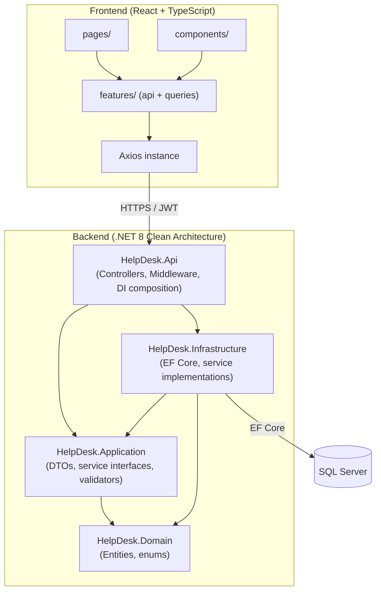

# IT Help Desk & Ticketing Management System

A full-stack enterprise IT Help Desk & Ticketing Management System built with a .NET 8 Clean Architecture backend and a React + TypeScript frontend. Built incrementally, phase by phase, per [`PROJECT_SPEC.md`](PROJECT_SPEC.md).

## Project Overview

Organizations need a reliable way for employees to report IT problems and for support staff to track, prioritize, and resolve them without things falling through the cracks. This system provides that: employees submit tickets, IT Support Agents and Managers triage and work them through a defined status workflow, and Admins/Managers get visibility into team performance through a dashboard and exportable reports.

**Target users:**
- **Employees** — submit and track their own support requests
- **IT Support Agents** — pick up, work, and resolve tickets assigned to them
- **Managers** — oversee team workload, reassign tickets, monitor SLA compliance
- **Admins** — full system oversight

**Business purpose:** replace ad-hoc email/chat-based IT support with a structured, auditable ticketing workflow — every status change, assignment, and comment is tracked in a permanent history, and managers get real-time KPI/SLA visibility instead of having to ask around for status updates.

## Main Features

### Authentication
- JWT-based authentication (access + refresh tokens)
- Role-based authorization (Admin, Manager, IT Support Agent, Employee)
- Registration, login, logout, forgot/reset/change password, profile management
- Persistent login with automatic token refresh

### Ticket Management
- Ticket creation with category, priority, and due date
- Full CRUD with soft delete/restore
- Search, filter (category/priority/status/assignee), sort, and pagination
- Automatic, immutable ticket history — every field change is recorded

### Workflow
- Manual assignment, reassignment, and round-robin auto-assignment
- Dedicated assignment history (who assigned what, to whom, when)
- Public comments and Agent-only internal notes
- @Mentions with highlighted rendering
- In-app notifications (assignment, comments, mentions) with an email stub
- Unified ticket timeline merging history, assignments, and comments

### Dashboard
- KPI summary cards (total/open/in-progress/resolved/closed/overdue/unassigned, average resolution time)
- Pie charts (tickets by category, tickets by priority)
- Line chart (monthly ticket volume — created vs. resolved)
- Bar chart (resolution time by priority)
- SLA compliance dashboard with a breached-ticket table
- PDF and Excel report export of the same data

### Administration
- Secure ticket file upload/download — storage outside the web root, extension and size validation, GUID-based stored filenames
- User management — create accounts, assign roles, activate/deactivate
- Category/Priority/Status management (full CRUD, soft delete)
- System Settings — site name, file upload limits, default page size (enforced live by the upload validator)
- Activity Log Viewer — filterable, paginated system-wide audit trail

## Technology Stack

**Frontend**
- React 19 + TypeScript
- Vite
- Tailwind CSS v4
- shadcn/ui
- TanStack Query
- Axios
- React Hook Form + Zod
- Recharts

**Backend**
- ASP.NET Core 8 Web API
- Clean Architecture (Domain / Application / Infrastructure / Api)
- Entity Framework Core 8
- ASP.NET Identity
- JWT Bearer authentication
- FluentValidation, AutoMapper, Serilog
- Swagger / OpenAPI
- QuestPDF (PDF reports), ClosedXML (Excel reports)

**Database**
- SQL Server (LocalDB for local development)

**Testing**
- xUnit + Moq (unit tests)
- `WebApplicationFactory`-based integration tests

## Architecture

The backend follows Clean Architecture: dependencies only ever point inward, toward `Domain`.



- **`HelpDesk.Domain`** — entities and enums only, no dependencies on any other layer.
- **`HelpDesk.Application`** — DTOs, service interfaces, FluentValidation validators, AutoMapper profiles. Depends only on `Domain`.
- **`HelpDesk.Infrastructure`** — EF Core `DbContext`, service implementations, external integrations (email stub, PDF/Excel generation). Depends on `Application` + `Domain`.
- **`HelpDesk.Api`** — controllers, middleware, DI composition root. Depends on all layers.

**Frontend structure:**
- `components/` — reusable UI building blocks, organized by feature area (`tickets/`, `dashboard/`, `notifications/`)
- `features/` — per-feature `api.ts` (Axios calls) + `queries.ts` (TanStack Query hooks) + `schemas.ts` (Zod)
- `pages/` — route-level components
- `routes/` — router configuration and route guards

Full explanation: [`docs/ARCHITECTURE.md`](docs/ARCHITECTURE.md).

## Database Design

| Entity | Purpose |
|---|---|
| `ApplicationUser` | System users (Identity-backed), with role assignments |
| `Category` / `Priority` / `Status` | Lookup tables for ticket classification and workflow state |
| `Ticket` | Core ticket record — title, description, category, priority, status, assignee, due date, resolution/close timestamps |
| `TicketHistory` | Immutable audit trail of every field change on a ticket |
| `TicketAssignment` | Assignment-specific audit trail (manual vs. round-robin, previous/new assignee, assigned-by) |
| `TicketComment` | Public comments and Agent-only internal notes (`IsInternal` flag) |
| `TicketAttachment` | File attachments on a ticket |
| `Notification` | In-app notifications (assignment, comment, mention) per user |
| `ActivityLog` | System-wide activity/audit log |
| `RefreshToken` | JWT refresh token store |
| `SystemSetting` | Singleton row of admin-configurable settings (site name, upload limits, page size) |

Key relationships: a `Ticket` belongs to one `Category`, one `Priority`, one `Status`, is created by one `ApplicationUser`, and may be assigned to another. `TicketHistory`, `TicketAssignment`, `TicketComment`, and `Notification` all reference their parent `Ticket`. Soft delete (`IsDeleted`/`DeletedAt`) is applied globally via an EF Core query filter.

Full schema, constraints, and indexes: [`docs/database-design.md`](docs/database-design.md) and [`docs/DATABASE.md`](docs/DATABASE.md).

## How to Run the Project

Two options: **Docker Compose** (one command, no local .NET/Node/SQL Server install needed) or **native** (run the API and frontend directly on your machine). Full detail in [`docs/DEPLOYMENT_GUIDE.md`](docs/DEPLOYMENT_GUIDE.md) and [`docs/SETUP_GUIDE.md`](docs/SETUP_GUIDE.md) respectively — the quick version of each is below.

### Option A: Docker Compose

```bash
cp .env.example .env   # set MSSQL_SA_PASSWORD and JWT_SECRET_KEY (see comments in the file)
docker compose up --build
```

Starts all three containers (SQL Server → API → frontend, in that dependency order, each gated on the previous one's health check):

- Frontend: `http://localhost:3000`
- API + Swagger: `http://localhost:5019/swagger`
- Health check: `http://localhost:5019/health`

### Option B: Native

### Prerequisites
- [.NET 8 SDK](https://dotnet.microsoft.com/download)
- [Node.js](https://nodejs.org/) 20+ and npm
- SQL Server LocalDB (or a real SQL Server/Express instance)
- The `dotnet-ef` global tool: `dotnet tool install --global dotnet-ef`

### Backend

```bash
cd backend
dotnet restore
dotnet build HelpDesk.sln

# Configure the JWT signing key (kept out of source control via dotnet user-secrets)
cd src/HelpDesk.Api
dotnet user-secrets init
dotnet user-secrets set "Jwt:SecretKey" "<a-random-string-32-chars-or-longer>"
cd ../..

# Apply migrations (creates HelpDeskSystemDb on LocalDB and seeds lookup data + roles)
dotnet ef database update --project src/HelpDesk.Infrastructure --startup-project src/HelpDesk.Api

dotnet run --project src/HelpDesk.Api
```

The API listens on `http://localhost:5019` by default. Run the backend test suite with:

```bash
cd backend
dotnet test
```

### Frontend

```bash
cd frontend
npm install
npm run dev
```

Opens at `http://localhost:5173`, talking to the API URL configured in `frontend/.env.development` (`VITE_API_BASE_URL`).

```bash
npm run build   # type-check + production build
npm run lint    # ESLint
```

### Database setup notes

Migrations live in `backend/src/HelpDesk.Infrastructure/Persistence/Migrations/`. `dotnet ef database update` applies all pending migrations and seeds lookup data (categories/priorities/statuses) and Identity roles. An idempotent SQL script covering every migration to date is also checked in at `backend/database/InitialCreate.sql`, for environments without the `dotnet-ef` tool.

## API Documentation

Swagger UI is available at `http://localhost:5019/swagger` in every environment (Development, Docker, or otherwise) — it documents every endpoint, request/response schema, and lets you authorize with a JWT bearer token to try requests interactively. A static export of the OpenAPI document is also checked in at [`docs/swagger/swagger.json`](docs/swagger/swagger.json). See [`docs/api-guide.md`](docs/api-guide.md) for a written walkthrough of the main endpoint groups with example requests/responses.

## Development Progress

| Phase | Description | Status |
|---|---|---|
| Phase 1 | Foundation (Clean Architecture, EF Core, frontend scaffold) | ✅ Completed |
| Phase 2 | Authentication (JWT, Identity, roles, protected routes) | ✅ Completed |
| Phase 3 | Ticket Management (CRUD, search, filtering, history) | ✅ Completed |
| Phase 4 | Workflow (assignment, comments, notifications) | ✅ Completed |
| Phase 5 | Dashboard & Reports (KPIs, charts, PDF/Excel export) | ✅ Completed |
| Phase 6 | Administration (user/role management, lookup CRUD, secure file upload/download) | ✅ Completed |
| Phase 7 | Hardening (security headers, JWT/upload validation, expanded test suite, frontend resilience) | ✅ Completed |
| Phase 8 | Production Readiness (Docker Compose, deployment docs, release `v1.0.0`) | ✅ Completed |

Full roadmap: [`docs/ROADMAP.md`](docs/ROADMAP.md).

## Testing & API Tooling

- **Backend test suite**: 149 tests (114 unit + 35 integration/API), all passing — see [`docs/PHASE7_TESTING_REPORT.md`](docs/PHASE7_TESTING_REPORT.md) for the full breakdown and [`docs/PHASE7_COVERAGE_REPORT.md`](docs/PHASE7_COVERAGE_REPORT.md) for coverage numbers.
- **Postman collection**: [`postman/HelpDesk-API.postman_collection.json`](postman/HelpDesk-API.postman_collection.json) (+ [`postman/HelpDesk-Local.postman_environment.json`](postman/HelpDesk-Local.postman_environment.json)) covers every endpoint, with test scripts that auto-populate tokens/ids so it's runnable end-to-end after importing.

## Future Improvements

- AI-assisted ticket classification (auto-suggest category/priority)
- Chat assistant for common IT issues
- CI/CD pipeline (build, test, and deploy on push)
- Real-time notification delivery (SignalR/WebSockets) instead of polling
- Configurable per-priority SLA policies
- Custom role creation (today's 4 roles are fixed, hardcoded into every authorization policy)
- Rate-limiting on login/register beyond ASP.NET Identity's built-in lockout
- Hash refresh tokens at rest (currently stored as plaintext)
- Automated frontend test suite (Vitest/Testing Library)

## Repository Layout

```
HelpDeskSystem/
├── backend/            # .NET 8 Clean Architecture solution (Domain / Application / Infrastructure / Api / tests)
│   └── Dockerfile
├── frontend/           # Vite + React + TypeScript client
│   ├── Dockerfile
│   └── nginx.conf
├── docker-compose.yml  # API + frontend + SQL Server, orchestrated together
├── .env.example        # Template for docker-compose.yml's required secrets
├── postman/            # Complete Postman collection + environment
├── docs/               # Architecture, database, API, deployment, and process documentation
├── screenshots/        # Application screenshots for this README/portfolio use
├── RELEASE_NOTES.md
└── PROJECT_SPEC.md
```

Full tree: [`docs/FOLDER_STRUCTURE.md`](docs/FOLDER_STRUCTURE.md).

## Documentation

- [`docs/ARCHITECTURE.md`](docs/ARCHITECTURE.md) — Clean Architecture layering, frontend architecture, tech stack, coding standards, configuration
- [`docs/database-design.md`](docs/database-design.md) — entities, relationships, and design decisions (see also [`docs/DATABASE.md`](docs/DATABASE.md) for full schema/index detail)
- [`docs/api-guide.md`](docs/api-guide.md) — main endpoint groups with example requests/responses
- [`docs/development-notes.md`](docs/development-notes.md) — problems encountered, solutions, and lessons learned building this project
- [`docs/PHASE2_AUTHENTICATION.md`](docs/PHASE2_AUTHENTICATION.md) · [`PHASE3_TICKET_MANAGEMENT.md`](docs/PHASE3_TICKET_MANAGEMENT.md) · [`PHASE4_TICKET_WORKFLOW.md`](docs/PHASE4_TICKET_WORKFLOW.md) · [`PHASE5_DASHBOARDS_REPORTING.md`](docs/PHASE5_DASHBOARDS_REPORTING.md) · [`PHASE6_ADMINISTRATION.md`](docs/PHASE6_ADMINISTRATION.md) · [`PHASE7_HARDENING.md`](docs/PHASE7_HARDENING.md) · [`PHASE8_PRODUCTION_READINESS.md`](docs/PHASE8_PRODUCTION_READINESS.md) — what each phase added and how it was verified
- [`docs/PHASE7_TESTING_REPORT.md`](docs/PHASE7_TESTING_REPORT.md) · [`PHASE7_COVERAGE_REPORT.md`](docs/PHASE7_COVERAGE_REPORT.md) — Phase 7's full test breakdown and code coverage numbers
- [`docs/SETUP_GUIDE.md`](docs/SETUP_GUIDE.md) — native (non-Docker) local development setup
- [`docs/DEPLOYMENT_GUIDE.md`](docs/DEPLOYMENT_GUIDE.md) — Docker Compose deployment, verification, and troubleshooting
- [`docs/USER_GUIDE.md`](docs/USER_GUIDE.md) — feature walkthrough per role (Employee/Agent/Manager/Admin)
- [`docs/DEPLOYMENT_CHECKLIST.md`](docs/DEPLOYMENT_CHECKLIST.md) · [`PRODUCTION_CHECKLIST.md`](docs/PRODUCTION_CHECKLIST.md) — pre-flight checklist and what changes before a real production launch
- [`docs/PRESENTATION_SUMMARY.md`](docs/PRESENTATION_SUMMARY.md) — one-page portfolio/interview summary
- [`RELEASE_NOTES.md`](RELEASE_NOTES.md) — changelog by phase for the `v1.0.0` release
- [`docs/PITFALLS.md`](docs/PITFALLS.md) — the detailed technical issue/fix log this project's `development-notes.md` summarizes
- [`docs/ROADMAP.md`](docs/ROADMAP.md) — remaining phases
