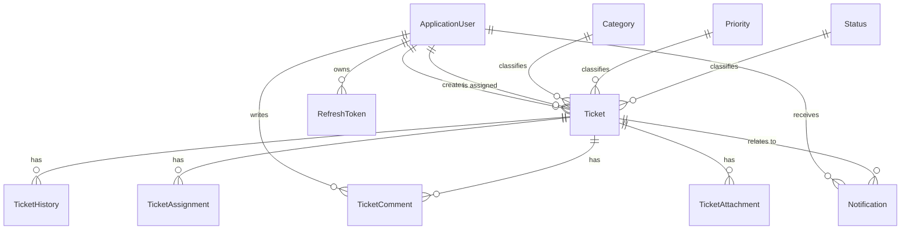

# Database Design

A concise, portfolio-facing overview of the schema and the relationships between entities. For full column-level detail — data types, constraints, indexes, and the exact migration history — see [`DATABASE.md`](DATABASE.md).

## Entity Overview

| Entity | Description |
|---|---|
| **ApplicationUser** | Extends ASP.NET Identity's user model with `FirstName`, `LastName`, `Department`, `JobTitle`, `IsActive`. Roles: Admin, Manager, IT Support Agent, Employee. |
| **Category** | Ticket classification lookup (Hardware, Software, Network, Email, Access Request, Other). |
| **Priority** | Ticket urgency lookup (Low, Medium, High, Critical). |
| **Status** | Ticket workflow state lookup (Open, In Progress, Pending, Resolved, Closed). |
| **Ticket** | The core record: title, description, category, priority, status, creator, assignee, due date, resolved/closed timestamps, ticket number. |
| **TicketHistory** | One row per field change on a ticket — field name, old value, new value, who changed it, when. Immutable. |
| **TicketAssignment** | One row per assignment event — previous assignee, new assignee, who performed it (null for round-robin), assignment type. |
| **TicketComment** | Public comments and Agent-only internal notes on a ticket, distinguished by an `IsInternal` flag. |
| **TicketAttachment** | File attachments on a ticket. |
| **Notification** | In-app notifications delivered to a user (ticket assigned, commented on, mentioned), with read/unread state. |
| **ActivityLog** | System-wide audit log of significant actions (login, ticket created, deleted, restored, etc.). |
| **RefreshToken** | Issued JWT refresh tokens, for rotation and revocation. |

## Entity Relationship Diagram

## Design Decisions

- **Soft delete everywhere.** Every entity implementing `ISoftDelete` (`Ticket`, `ApplicationUser`, etc.) is excluded from queries by a global EF Core query filter (`IsDeleted == false`) rather than being physically removed — a deleted ticket can be restored by a Manager/Admin, and its history is never lost.
- **Audit fields on every entity.** `BaseEntity` gives every table `CreatedAt`/`CreatedBy`/`UpdatedAt`/`UpdatedBy` automatically via `AppDbContext.SaveChanges` overrides — no service method has to remember to stamp these manually.
- **History is append-only.** `TicketHistory` and `TicketAssignment` rows are never updated or deleted; they're the permanent audit trail the ticket workflow depends on.
- **SLA compliance uses `Ticket.DueDate`**, not a separate configurable policy table — see [`PHASE5_DASHBOARDS_REPORTING.md`](PHASE5_DASHBOARDS_REPORTING.md) for the reasoning.

Full column definitions, constraints, and indexes: [`DATABASE.md`](DATABASE.md).
